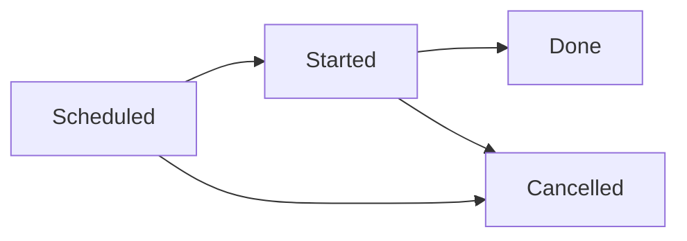

# AE2CC Bridge

AE2CC Bridge adds a simple peripheral block that may be used to access an [Applied Energistics 2](https://github.com/AppliedEnergistics/Applied-Energistics-2)
ME system from [ComputerCraft](https://github.com/cc-tweaked/cc-restitched) computers.

> [!IMPORTANT]
> This mod is inherently unbalanced. The peripheral access to the ME system
> provided by this mod allows players to circumvent channel limitations and
> perform arbitrary logic at effectively no energy cost.

> [!NOTE]
> Currently, the peripheral only exposes a fairly small API. If you find that
> functionality you need is missing, please file a feature request in our issue
> tracker.


## Peripheral API (Functions)

### `getAvailableObjects()`

Returns a list of objects that are currently available in the ME system.

#### Returns

1. `{ { type = string, id = string, displayName = string, amount = number }... }` –
   a table with a list of objects available in the ME system


### `getCraftableObjects()`

Returns a list of objects that can be crafted by the ME system.

#### Returns

1. `{ { type = string, id = string, displayName = string }... }` – a table with
   a list of objects that can be crafted by the ME system


### `getCraftingCPUs()`

Returns a list of crafting CPUs available in the ME system.

#### Returns

1. `{ cpu... }`

where `cpu` is a table defined as follows:

| Key                     | Type      | Description                                                                      |
|-------------------------|-----------|----------------------------------------------------------------------------------|
| `availableCoProcessors` | `number`  | The number of available co-processors.                                           |
| `availableStorage`      | `number`  | The amount of available crafting storage.                                        |
| `selectionMode`         | `string`  | The selection mode of the CPU. (Either `ANY`, `MACHINE_ONLY`, or `PLAYER_ONLY`.) |
| `jobStatus`             | `string?` | Information about the currently running job.                                     |
| `name`                  | `string?` | The custom name of the CPU.                                                      |

where `jobStatus` is a table defined as follows:

| Key              | Type      | Description                                                           |
|------------------|-----------|-----------------------------------------------------------------------|
| `totalObjects`   | `number`  | The total amount of objects that will be crafted during the job.      |
| `craftedObjects` | `number`  | The amount of crafted objects.                                        |
| `elapsedNanos`   | `number`  | The time (in nanoseconds) that has elapsed since the job has started. |
| `systemID`       | `string?` | The ID given to the running job by the ME system.                     |
| `output`         | `output`  | The job's output.                                                     |

where `output` is defined as follows:

| Key           | Type     | Description                      |
|---------------|----------|----------------------------------|
| `amount`      | `number` | The number of requested objects. |
| `type`        | `string` | The type of the object.          |
| `id`          | `string` | The ID of the object.            |
| `displayName` | `string` | The display name of the object.  |


#### Remarks

For technical reasons, determining the `systemID` may fail in some cases. If
this happens, the `systemID` is not included and an error is logged. If you
are using up-to-date versions of AE2 and AE2CC Bridge, please make sure this
issue is known in the issue tracker for your versions.


### `getIssuedCraftingJobs`

Returns a list of unfinished crafting jobs issued by the peripheral.

#### Returns

1. `{ { state = string, jobID = string, systemID = string? }... }` – a table with
   a list of objects for each unfinished job issued by the peripheral.

#### Remarks

For a job to be included in the output, its state must either be `SCHEDULED` or
`STARTED`. If the job has started running, an additional `systemID` is field is
included. This ID is the ID given to the running job by the ME system (opposed
to the `jobID` which is local to a peripheral).


### `scheduleCrafting(type, id, amount)`

Schedules a crafting job.

#### Parameters

1. `type`: `string` – the type of the object to craft ("fluid" or "item")
2. `id`: `string` – the ID of the object to craft
3. `amount`: `number` – the amount of the object to craft

#### Returns

1. `string` – a unique ID representing the crafting job

#### Remarks

> **Note**: This method is deliberately named `scheduleCrafting` as scheduling a
> crafting job does not actually start a crafting process immediately. Instead,
> the crafting job is started at some point in the future when the ME system is
> ready.

To work with crafting jobs, it is necessary to understand their lifecycle.



Initially, a newly created crafting job's state is `SCHEDULED`. During creation,
the ME system is instructed to prepare for the crafting job (which includes
calculating) the exact crafting plan.

Once the system has finished all necessary preparations, the crafting job's
state changes to `STARTED`. The `ae2cc:crafting_started` event can be used to
listen to this state change.

Finally, when the crafting job is finished, it's state changes to `DONE` and the
`ae2cc:crafting_done` event is fired.

Additionally, if the job is cancelled or an error occurs at any point of the
crafting job's lifecycle, the `ae2cc:crafting_cancelled` event is fired.


## Peripheral API (Events)

### `ae2cc:crafting_cancelled`

The `ae2cc:crafting_cancelled` event is fired when a crafting job is cancelled.

#### Return Values

1. `string` – the name of the event
2. `string` – the ID of the cancelled crafting job
3. `string` - the reason for the cancellation

#### Remarks

The reason for the cancellation is always one of:

| Value                | Description                                                 |
|----------------------|-------------------------------------------------------------|
| `CANCELLED`          | The job was cancelled (either manually or by a machine).    |
| `CPU_NOT_FOUND`      | The selected crafting CPU was not found.                    |
| `INCOMPLETE_PLAN`    | No crafting plan could be calculated for the job.           |
| `NO_CPU_FOUND`       | No crafting CPU to execute the job was found.               |
| `CPU_BUSY`           | The selected crafting CPU is busy.                          |
| `CPU_OFFLINE`        | The selected crafting CPU is offline.                       |
| `CPU_TO_SMALL`       | The selected crafting CPU is too small to process the job.  |
| `MISSING_INGREDIENT` | Could not obtain one of the ingredients needed for the job. |


### `ae2cc:crafting_done`

The `ae2cc:crafting_done` event is fired when a crafting job is done.

#### Return Values

1. `string` – the name of the event
2. `string` – the ID of the finished crafting job


### `ae2cc:crafting_started`

The `ae2cc:crafting_started` event is fired when the state of a previously
_SCHEDULED_ crafting job changes to _STARTED_.

#### Return Values

1. `string` – the name of the event 
2. `string` – the ID of the started crafting job


## Versioning

AE2CC Bridge uses a custom versioning scheme that follows the spirit of the
[SemVer 2.0.0](https://semver.org/spec/v2.0.0.html) specification.

Given a version number `WORLD.API.FEATURE-MC-LOADER-TARGET.PATCH`, increment the:

1. `WORLD` version when you make save-game incompatible changes,
2. `API` version when you make incompatible API changes,
3. `FEATURE` version when you update functionality in a backwards compatible
   manner
4. `TARGET` version when you update to a backward incompatible version of your
   loader
5. `PATCH` version when you make backwards compatible bug fixes

The `MC` version should always be the version string of the targeted version of
Minecraft. If multiple Minecraft versions are supported by a single mod version,
typically the oldest supported version string should be chosen.

Similarly, the `LOADER` version should be used to indicate which mod loader the
version was written for (e.g. "FABRIC").


## Supported versions

| Minecraft Version                                               | State              |
|-----------------------------------------------------------------|--------------------|
| 1.19                                                            | Mainline           |
| [1.18](https://github.com/TheMrMilchmann/AE2CCBridge/tree/1.18) | Active Development |

**This is the mainline branch** for the development of _AE2CC Bridge_
which usually targets the most recent Minecraft version. The development for
other versions of Minecraft happens in the repositories and branches linked in
the table above.


### Support Cycle

| State                  | Description                                                  |
|------------------------|--------------------------------------------------------------|
| **Mainline**           | The primary development branch                               |
| **Active Development** | This version still receives all updates                      |
| **Maintenance Mode**   | This version still receives fixes but no new features        |
| **Unsupported**        | This version is unsupported and does not receive any updates |


## Building from source

### Setup

This project uses [Gradle's toolchain support](https://docs.gradle.org/7.6/userguide/toolchains.html)
to detect and select the JDKs required to run the build. Please refer to the
build scripts to find out which toolchains are requested.

An installed JDK 1.8 (or later) is required to use Gradle.

A local installation of CC:Restitched is required to build this mod. The
recommended way to create one is going to the submodule under `deps/cc-restitched`
and calling:

    gradlew jar publishToMavenLocal

### Building

Once the setup is complete, invoke the respective Gradle tasks using the
following command on Unix/macOS:

    ./gradlew <tasks>

or the following command on Windows:

    gradlew <tasks>

Important Gradle tasks to remember are:
- `clean`                   - clean build results
- `build`                   - assemble and test the Java library
- `runClient`               - runs the development client
- `runServer`               - runs the development server

Additionally `tasks` may be used to print a list of all available tasks.


## License

```
Copyright (c) 2022 Leon Linhart

Permission is hereby granted, free of charge, to any person obtaining a copy
of this software and associated documentation files (the "Software"), to deal
in the Software without restriction, including without limitation the rights
to use, copy, modify, merge, publish, distribute, sublicense, and/or sell
copies of the Software, and to permit persons to whom the Software is
furnished to do so, subject to the following conditions:

The above copyright notice and this permission notice shall be included in all
copies or substantial portions of the Software.

THE SOFTWARE IS PROVIDED "AS IS", WITHOUT WARRANTY OF ANY KIND, EXPRESS OR
IMPLIED, INCLUDING BUT NOT LIMITED TO THE WARRANTIES OF MERCHANTABILITY,
FITNESS FOR A PARTICULAR PURPOSE AND NONINFRINGEMENT. IN NO EVENT SHALL THE
AUTHORS OR COPYRIGHT HOLDERS BE LIABLE FOR ANY CLAIM, DAMAGES OR OTHER
LIABILITY, WHETHER IN AN ACTION OF CONTRACT, TORT OR OTHERWISE, ARISING FROM,
OUT OF OR IN CONNECTION WITH THE SOFTWARE OR THE USE OR OTHER DEALINGS IN THE
SOFTWARE.
```